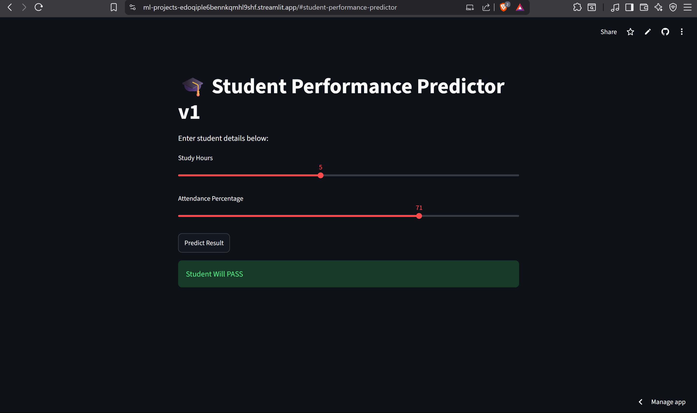

# 🎓 Student Pass/Fail Predictor

A Machine Learning web application that predicts whether a student may pass or fail based on study hours and attendance.

## 🚀 Live Demo

https://ml-projects-edoqiple6bennkqmhl9shf.streamlit.app/#student-performance-predictor

---

## 📸 App Screenshot

---

## 🛠 Technologies Used

* Python
* Streamlit
* Scikit-learn
* NumPy
* Pickle

---

## ✨ Features

* Interactive web interface
* Real-time prediction
* Machine learning model integration
* Streamlit deployment

---

## 👨‍💻 Author

Partha Sarathi
